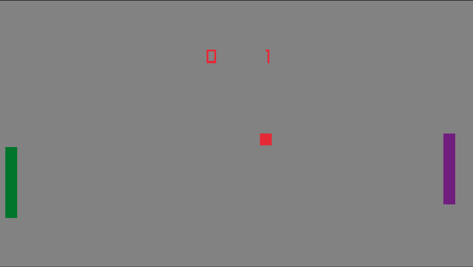

# Zig Pong
Pong made in Zig + Raylib



- Zig: 0.14
- Raylib: 5.5
- raylib-zig: *Fresh*

# Build and Run
Clone and in source directory run:
```sh
zig build run
```

# Credits
Thanks to
- [raylib](https://github.com/raysan5/raylib)
- [raylib-zig](https://github.com/Not-Nik/raylib-zig)
- [zig](https://github.com/ziglang/zig)
